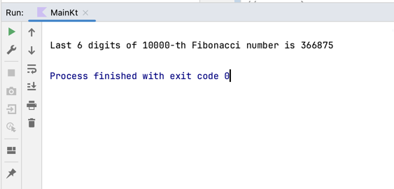
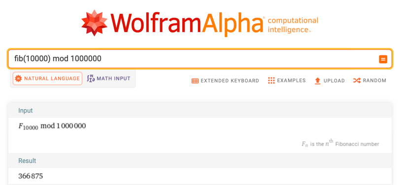

I’m absolutely sure you’ve heard about the *Fibonacci sequence* and tried to
tackle this task during at least one interview. What if I tell you this is a
popular interview task and an excellent tool for learning a *new programming*
language? If you doubt so, continue reading.

On the one hand, the Fibonacci sequence is a *beginner-friendly* task. It adds
the two preceding numbers to generate the next one: 0, 1, 1, 2, 3, 5, 8, 13,
21, and so on. That’s why you can quickly start learning all the basic statements
of your new language, such as *loops, if-statements, variables, CLI input/output,
and recursion*.

On the other hand, you can dive deeper and learn more advanced techniques such as
*binary pow, matrix multiplication, code optimization, and algorithmic complexity*.

I’ve decided to take this task, look at *Kotlin*, and take the *matrix approach*.
Let’s start with a small theory. So, everybody knows that we can calculate the
n-th Fibonacci number as a sum of two previous:

$
f_n = f_{n-1} + f_{n-2}
$

but we can also take the matrix form, which uses multiplication instead of addition:

$
\begin{bmatrix}
f_{n-1} \newline f_n
\end{bmatrix} =
\begin{bmatrix}
f_{n-2} \newline f_{n-1}
\end{bmatrix} * \begin{bmatrix}
0 & 1 \newline 1 & 1
\end{bmatrix}
$

so, using the associative property of the multiplication, we get

$
\begin{bmatrix}
f_{n} \newline f_{n+1}
\end{bmatrix} =
\begin{bmatrix}
0 \newline 1
\end{bmatrix} * \begin{bmatrix}
0 & 1 \newline 1 & 1
\end{bmatrix} ^ {n}
$

> **Small disclaimer:** since we'll be dealing with huge numbers that can lead to
> overflow issues for sufficiently large values of N, we won't actually calculate the N-th Fibonacci number in its
> entirety. Instead, we will focus on the last six digits of the N-th Fibonacci number. We'll occasionally use the `%`
> (mod) operator in our code to achieve this.

**Time to dive into coding!** Kotlin provides a nifty tool – data classes to store our matrices. According to the
documentation, data classes are explicitly designed to hold data. This fact makes them a perfect fit for our needs.

```kotlin
data class Matrix (val matrix: Array<Array<Long>>) {
    private fun countN() = matrix.count()
    private fun countM() = matrix.first().count()

    fun raw() = matrix
}
```

And now, we're all set to initialize our starting matrix by declaring a variable of our new data class, Matrix.
```kotlin
val initial = Matrix(arrayOf(arrayOf(0L, 1L)))
```

and the other matrix, which we'll raise to the power of N
```kotlin
val complement = Matrix(
    arrayOf(
        arrayOf(0L, 1L),
        arrayOf(1L, 1L)
    )
)
```

Let’s unlock the magic of matrix multiplication in our Kotlin program by giving the `*` operator a new 
job in our Matrix data class. It means we’re changing how it works when you use it with Matrix objects. 
Doing this makes it much easier to write matrix multiplication, just like we do in math class. It makes our 
code more straightforward and shows how Kotlin can be customized to do incredible things. 
As we go deeper into linear algebra, we’ll explore how our ` times ` function works behind the scenes. 
It’s like a wizard that ensures the matrices have the suitable shapes to be multiplied, making the whole 
process smooth and efficient. So, let’s keep exploring Kotlin and discover how we can use operator 
overloading to make matrix math a breeze!

```kotlin
const val mod = 1000_000L

data class Matrix (val matrix: Array<Array<Long>>) {
    // ...
    operator fun times(secondMatrix: Matrix): Matrix {
        val row1 = this.countN()
        val col1 = this.countM()
        val col2 = secondMatrix.countM()
    
        assert(row1 == col2)
    
        var resultArray = arrayOf<Array<Long>>()
    
        for (i in 0 until row1) {
            var lineArr = arrayOf<Long>()
            for (j in 0 until col2) {
                var item = 0L
                for (k in 0 until col1) {
                    item += (matrix[i][k] % mod * secondMatrix.raw()[k][j] % mod) % mod
                }
                lineArr += item
            }
            resultArray += lineArr
        }
    
        return Matrix(resultArray)
    }
    // ...
}
```

So, now we can write something like:
```kotlin
val result = initial * complement
```

But as we mentioned earlier, we require something similar to
```kotlin
val result = initial * pow(complement, n)
```

To solve this problem, we can use a clever algorithm called 
[Binary Exponentiation](https://cp-algorithms.com/algebra/binary-exp.html). It's efficient and works in just `O(log n)`
time, which means it's speedy. This algorithm makes exponentiation (raising a number to a power) much quicker. It does
this by cutting the exponent in half and using the results of previous calculations.

```kotlin
fun binpow(a: Matrix, n: Int): Matrix {
    if (n == 1) return a
    val result = binpow(a, n shr 1)
    if (n and 1 == 0) return result * result

    return a * binpow(a, n - 1)
}
```

In the end, the function for obtaining the N-th Fibonacci number will appear as follows:

```kotlin
fun fibonacci(n: Int): Long {
    val initial = Matrix(arrayOf(arrayOf(0L, 1L)))
    val complement = Matrix(
        arrayOf(
            arrayOf(0L, 1L),
            arrayOf(1L, 1L)
        )
    )

    val result = initial * binpow(complement, n - 1)

    return result.raw().first()[1]
}
```

And now we can run the program and get a result
```kotlin
fun main() {
    val n = 10000;
    println("Last 6 digits of $n-th Fibonacci number is " + fibonacci(n))
}
```

<p class="text-center">
    
</p>

Let's verify the result using Wolfram Alpha
<p class="text-center">
    
</p>

To sum it up, exploring the Fibonacci sequence in a new programming language like Kotlin has proven to be a valuable journey.
It’s not just a beginner-friendly exercise; it’s a gateway to mastering fundamental language constructs,
from loops to conditional statements, variables, command-line input/output, and even recursion.
However, it doesn’t stop there. Delving deeper reveals advanced techniques, from binary exponentiation to
matrix multiplication, code optimization, and understanding algorithmic complexity. 
Through this article, we’ve embarked on a Kotlin adventure, showcasing how the matrix approach adds
a new layer of insight and versatility to solving this classic problem. 
The Fibonacci sequence will remain a compelling companion as you continue your programming journey,
offering ever-increasing insights and challenges for the curious programmer.