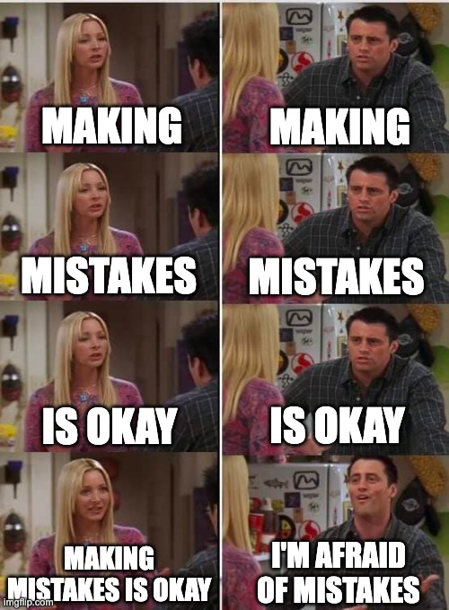

> **_NOTE:_** there are probably too many obvious things for a manager, 
> but sometimes you need to read some obvious stuff one more time to finally 
> get them. However, I've seen so many managers with several years of 
> experience who make the same mistakes, and with time, they come to similar 
> conclusions.
> 
### Leadership is one possible career development step.
The leadership position is one of many possible career development steps.
This is just another branch of a career. Many outstanding *individual contributors* 
are as *important* and *valuable* as a manager. Whether it's your path that feels
right, you should continue it; if not, feel free to become an IC again.
**It's not a step back but a step in a different direction.**
I know several examples where leadership was too much for the person,
but they feared changing something. Don't be afraid.
It would be best to enjoy being a leader/manager as this
directly affects your team, you, and the product overall.
### Delegation is critical.
I found delegation incredibly challenging at the beginning of my leadership path. 
But *you can't do everything by yourself*. You don't have time, and you took all
ways of growth and autonomy from your team. With more power, your team can grow
faster and better.
I saw how the team has been increasing during the last year and how happy they
became after starting decomposing tasks and reviewing each other.
I learned to deligate sufficiently only when I had too much on my plate and
couldn't do everything alone. Please avoid making the same mistake and start earlier.
### Create a safe space for mistakes.

    

Everyone is afraid of mistakes: *your senior developers can be frightened of
making mistakes as much as your junior developers*, especially when they get a
new leader. So, you should create a safe space for everyone and remember to
celebrate mistakes and learn from them. You should tell your team about this
and show them in your example that mistakes are okay; this is an excellent
point of improvement and the best way to grow. How to?
Present your latest error to everyone and tell them what you've learned from
this mistake. And please, don't start from someone's mistake if your team fears
doing them. Why? It could look for them more as public punishment than a
celebration. What can be done more? Add a *premortem session* before some huge or
complicated features. A prepared plan in case of failure is a real treasure in
stressful times.
### One-on-ones are for communication, not just status updates.
Status updates can be done during standups or in written form.
Save this precious time on such tasks. *One-ones are for communication, creating
a safe space, and gaining trust*. All of us heard that this time is not for you
but for your teammate. However, to gain trust, you should be open, honest,
and ready to share your experience and thoughts on some topics.
### Remember that you're not a therapist.
So if you feel that someone feels not great, it's better to tell them
about opportunities for wellbeing in your company.
### Lead by example.
You're an example for others. Remember to do what you tell and recommend them.
If you ask teammates not to overwork and keep a work-life balance, you should do
the same. Why? Because actions mean more than words,
you'll lose trust if you tell one thing and do the opposite.